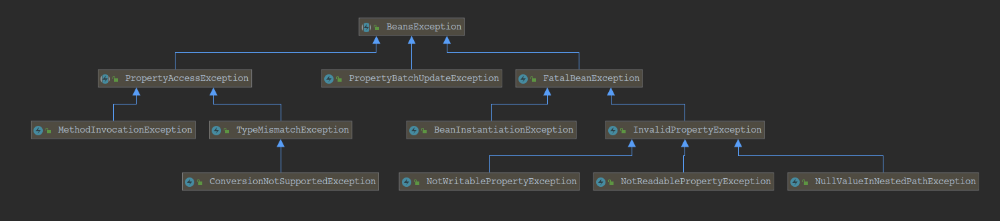
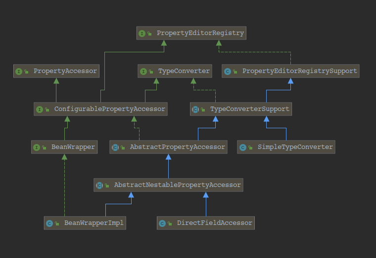
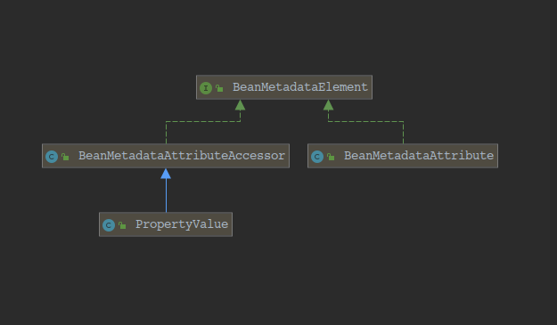
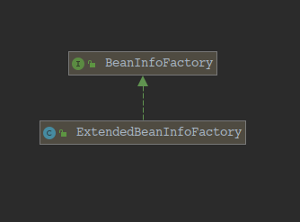
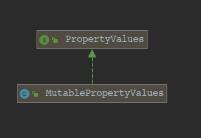

[TOC]
## beans.package-info
		该包包含用于操作Java bean的接口和类。它被大多数其他Spring包使用。
    	BeanWrapper对象可用于单独或批量设置和获取bean属性。
    	这个包中的类在Rod Johnson的 Expert One-On-One J2EE Design and Development 的第11章中讨论过（Wrox，2002）。
---
**BeansException继承体系**

## BeansException 解读
		bean包和子包中抛出的所有异常的抽象超类。
        请注意，这是一个运行时（未经检查）的异常。Bean 类例外通常是致命的;他们没有理由被检查。
## PropertyAccessException 解读
		与属性访问相关的异常的超类，例如类型不匹配或调用目标异常。
## PropertyBatchUpdateException 解读
		组合异常，由各个PropertyAccessException实例组成。在绑定过程开始时创建此类的对象，并在必要时添加错误。
		绑定过程在遇到应用程序级PropertyAccessExceptions时继续，应用可应用的更改并将拒绝的更改存储在此类的对象中。
## FatalBeanException 解读
		抛出bean包或子包中遇到的不可恢复的问题，例如：糟糕的阶级或领域。
## TypeMismatchException 解读
		尝试设置bean属性时，类型不匹配时抛出异常。
## MethodInvocationException 解读
		当bean属性getter或setter方法抛出异常时抛出，类似于InvocationTargetException。
## ConversionNotSupportedException 解读
		如果找不到bean属性的合适编辑器或转换器，则抛出异常。
## BeanInstantiationException 解读
		实例化bean失败时抛出异常。携带违规的bean类。
## InvalidPropertyException 解读
		引用无效的bean属性时抛出异常。携带违规的bean类和属性名称。
## NullValueInNestedPathException 解读
		当有效嵌套属性路径的导航遇到NullPointerException时抛出异常。
        例如，导航“spouse.age”可能会失败，因为目标对象的配偶属性具有空值。
## NotReadablePropertyException 解读
		尝试获取不可读的属性值时抛出异常，因为没有getter方法。
## NotWritablePropertyException 解读
		尝试设置不可写的属性的值时抛出异常（通常因为没有setter方法）。
---
**PropertyEditorRegistry继承体系图:**

## PropertyEditorRegistry 解读
		封装用于注册JavaBeans PropertyEditors的方法。这是PropertyEditorRegistrar操作的中央接口。
    	由BeanWrapper扩展;由BeanWrapperImpl和DataBinder实现。
## PropertyAccessor 解读
		可以访问命名属性的类的公共接口（例如对象的bean属性或对象中的字段）用作BeanWrapper的基接口。
## TypeConverter 解读
		定义类型转换方法的接口。通常（但不一定）与PropertyEditorRegistry接口一起实现。
    	注意：由于TypeConverter实现通常基于不是线程安全的PropertyEditors，因此TypeConverters本身也不被视为线程安全。
## PropertyEditorRegistrySupport 解读
		PropertyEditorRegistry接口的基本实现。提供默认编辑器和自定义编辑器的管理。主要用作BeanWrapperImpl的基类。
## ConfigurablePropertyAccessor 解读
		封装PropertyAccessor的配置方法的接口。还扩展了PropertyEditorRegistry接口，该接口定义了PropertyEditor管理的方法。
        用作BeanWrapper的基本接口。
## TypeConverterSupport 解读
		TypeConverter接口的基本实现，使用package-private委托。主要用作BeanWrapperImpl的基类。
## AbstractPropertyAccessor 解读
		PropertyAccessor接口的抽象实现。提供所有便捷方法的基本实现，实现对子类的实际属性访问。
## BeanWrapper 解读
		Spring的低级JavaBeans基础结构的中央接口。
        通常不直接使用，而是通过BeanFactory或DataBinder隐式使用。
        提供分析和操作标准JavaBeans的操作：获取和设置属性值（单独或批量），获取属性描述符以及查询属性的可读性/可写性的能力。
        此接口支持嵌套属性，可以将子属性上的属性设置为无限深度。
        BeanWrapper的“extractOldValueForEditor”设置的默认值为“false”，以避免由getter方法调用引起的副作用。将其设置为
    “true”以将当前属性值公开给自定义编辑器。
## AbstractNestablePropertyAccessor 解读
		一个基本的ConfigurablePropertyAccessor，为所有典型用例提供必要的基础结构。
        如有必要，此访问器将集合和数组值转换为相应的目标集合或数组。处理集合或数组的自定义属性编辑器可以通过PropertyEditor的
    setValue写入，也可以通过setAsText写入逗号分隔的String，因为如果数组本身不可分配，则String数组将以这种格式转换。
## AbstractNestablePropertyAccessor.PropertyHandler 解读
		特定属性的处理程序。
## AbstractNestablePropertyAccessor.PropertyTokenHolder 解读
		持有类用于存储属性令牌。
## DirectFieldAccessor 解读
		ConfigurablePropertyAccessor实现，直接访问实例字段。允许直接绑定到字段，而不是通过JavaBean setter。
        从Spring 4.2开始，绝大多数BeanWrapper功能已合并到AbstractPropertyAccessor，这意味着现在也支持属性遍历以及集合和
    映射访问。
    	DirectFieldAccessor的“extractOldValueForEditor”设置的默认值为“true”，因为始终可以在没有副作用的情况下读取字段。
## SimpleTypeConverter 解读
		简单实现不在特定目标对象上运行的TypeConverter接口。这是使用完整的BeanWrapperImpl实例来满足任意类型转换需求的替代方法，
    同时使用相同的转换算法（包括委托给PropertyEditor和ConversionService）。
    	注意：由于依赖于PropertyEditors，SimpleTypeConverter不是线程安全的。为每个线程使用单独的实例。
## BeanWrapperImpl 解读
		默认的BeanWrapper实现应该足以满足所有典型用例。缓存内省效率的结果。
        注意：自动注册org.springframework.beans.propertyeditors包中的默认属性编辑器，除了JDK的标准PropertyEditors之外，
    它还适用。应用程序可以调用PropertyEditorRegistrySupport.registerCustomEditor（Class，java.beans.PropertyEditor）
    方法来注册特定实例的编辑器（即它们不在应用程序中共享）。有关详细信息，请参阅基类PropertyEditorRegistrySupport。
    	注意：从Spring 2.5开始，对于几乎所有目的而言，这是一个内部类。它只是公开的，以允许从其他框架包访问。对于标准应用程序访问
    目的，请改用PropertyAccessorFactory.forBeanPropertyAccess（java.lang.Object）工厂方法。
---
**BeanMetadataElement 继承体系**

## BeanMetadataElement 解读
		由携带配置源对象的bean元数据元素实现的接口。
## BeanMetadataAttributeAccessor 解读
		AttributeAccessorSupport的扩展，将属性保存为BeanMetadataAttribute对象，以便跟踪定义源。
## PropertyValue 解读
		用于保存单个bean属性的信息和值的对象。在此处使用对象，而不是仅将所有属性存储在由属性名称键入的映射中，允许更灵活，并且能够
    以优化的方式处理索引属性等。
    	请注意，该值不需要是最终所需的类型：BeanWrapper实现应该处理任何必要的转换，因为此对象不知道它将应用于哪些对象。
## BeanMetadataAttribute 解读
		持有键值样式属性，它是bean定义的一部分。除了键值对之外，还要跟踪定义源。
---
**BeanInfoFactory 继承体系**

## BeanInfoFactory 解读
		用于为Spring bean创建BeanInfo实例的策略接口。可用于插入自定义bean属性解析策略（例如，对于JVM上的其他语言）或更高效的
    BeanInfo检索算法。
    	BeanInfoFactories由CachedIntrospectionResults实例化，使用SpringFactoriesLoader实用程序类。当要创建BeanInfo时，
    CachedIntrospectionResults将遍历已发现的工厂，并在每个工厂上调用getBeanInfo（Class）。如果返回null，则将查询下一个工厂。
    如果没有工厂支持该类，则将创建标准BeanInfo作为默认值。
    	请注意，SpringFactoriesLoader按@Order对BeanInfoFactory实例进行排序，因此优先级较高的实例首先排序。
## ExtendedBeanInfoFactory 解读
		BeanInfoFactory实现，用于评估bean类是否具有“非标准”JavaBeans setter方法，因此可以通过Spring（包可见）
    ExtendedBeanInfo实现进行内省。
        在Ordered.LOWEST_PRECEDENCE处订购，以允许其他用户定义的BeanInfoFactory类型优先。
---
**PropertyValues 继承体系**

## PropertyValues 解读
## MutablePropertyValues 解读
## 解读
## 解读
## 解读
## 解读
## 解读
## 解读
## 解读
## 解读
## 解读
## 解读
## 解读
## 解读
## 解读
## 解读
## 解读
## 解读
## 解读
## 解读
## 解读
## 解读
## 解读
## 解读
## 解读
## 解读
## 解读
## 解读
## 解读
## 解读
## 解读
## 解读
## 解读
## 解读
## 解读
## 解读
## 解读
## 解读
## 解读
## 解读
## 解读
## 解读
## 解读
## 解读
## 解读
## 解读
## 解读
## 解读
## 解读
## 解读
## 解读
## 解读
## 解读
## 解读
## 解读
## 解读
## 解读
## 解读

