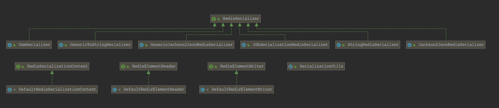

## interface RedisSerializer
		对象到字节数组的基本接口序列化和反序列化（二进制数据）。建议实现设计为在序列化和反序列化方面处理空对象/空数组。
    请注意，Redis不接受空键或值，但可以返回空回复（对于非现有键）。
---
	method:
    	byte[] serialize(T t) throws SerializationException:
        	将给定对象序列化为二进制数据。

		T deserialize(byte[] bytes) throws SerializationException:
        	从给定的二进制数据反序列化对象。

		static RedisSerializer<Object> java():
        	使用java序列化获取RedisSerializer。注意：确保您的域对象实际上是可序列化的。

		static RedisSerializer<Object> java(ClassLoader classLoader):
        	使用给定ClassLoader的java序列化获取RedisSerializer。注意：确保您的域对象实际上是可序列化的。

		static RedisSerializer<Object> json():
        	获取可以使用Jackson读写JSON的RedisSerializer。

		static RedisSerializer<String> string():
        	使用UTF-8作为默认的Charset，获取一个简单的String to byte []（和返回）序列化器。
## class OxmSerializer
		Spring的O / X Mapping之上的Serializer适配器。委托给OXM Marshaller和Unmarshaller序列化/反序列化。
    注意：null对象被序列化为空数组，反之亦然。
## class GenericToStringSerializer
		byte[]（和后面）序列化程序的通用字符串。依赖Spring ConversionService将对象转换为String，反之亦然。使用指定的
    字符集（默认为UTF-8）将字符串转换为字节，反之亦然。注意：如果将类定义为Spring bean，则会自动进行转换服务初始化。
    注意：不以任何特殊方式处理空值，将所有内容委托给容器。
## class GenericJackson2JsonRedisSerializer
## class Jackson2JsonRedisSerializer
		RedisSerializer可以使用Jackson和Jackson Databind ObjectMapper读写JSON。
        此转换器可用于绑定到类型化的bean或无类型的HashMap实例。注意：Null对象被序列化为空数组，反之亦然。
## class JdkSerializationRedisSerializer
		Java序列化Redis序列化程序。委派默认（基于Java）的序列化程序和DefaultDeserializer。该序列化器可以使用自定义
    ClassLoader或自己的转换器构建。
## class StringRedisSerializer
		简单字符串到byte []（和后面）序列化程序。使用指定的字符集（默认为UTF-8）将字符串转换为字节，反之亦然。
        当与Redis的交互主要通过字符串发生时很有用。
        不执行任何空转换，因为空字符串是有效的键/值。
## interface RedisSerializationContext
		反应使用的序列化上下文。
        此上下文为键，值，散列键（字段），散列值以及字符串序列化和反序列化提供
    RedisSerializationContext.SerializationPairs。
## interface RedisElementReader
		策略接口，指定可以将存储在Redis中的二进制元素表示反序列化为对象的反序列化程序。
## interface RedisElementWriter
		策略接口，指定可将元素序列化为其二进制表示形式的序列化程序，以用作Redis协议有效负载。
## class SerializationUtils
		具有各种序列化相关方法的实用程序类。