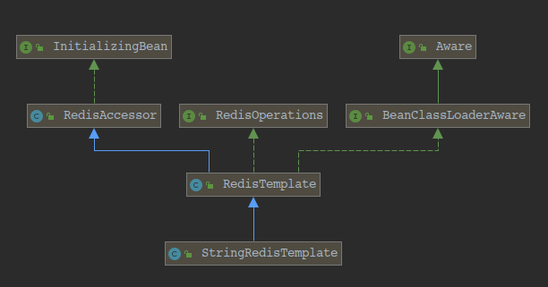

## interface InitializingBean
		由Bean实现的接口，一旦BeanFactory设置了所有属性，就需要做出反应：例如执行自定义初始化，或仅检查是否已设置所有必需
    属性。
    	实现InitializingBean的替代方法是指定自定义init方法，例如在XML bean定义中。有关所有bean生命周期方法的列表，
    请参阅BeanFactory javadocs。
---
	method:
    	void afterPropertiesSet() throws Exception:
			在设置了所有bean属性并满足BeanFactoryAware，ApplicationContextAware等之后，由包含BeanFactory调用。
            此方法允许bean实例在设置所有bean属性时执行其整体配置和最终初始化的验证。
            如果配置错误（例如未能设置基本属性）或初始化因任何其他原因而失败, 则抛出异常
## class RedisAccessor
		RedisTemplate的基类定义公共属性。不打算直接使用。
---
	method:
    	public void afterPropertiesSet():

       	public RedisConnectionFactory getConnectionFactory():
        	Returns the connectionFactory.

        public RedisConnectionFactory getRequiredConnectionFactory():
        	Returns the required RedisConnectionFactory or throws IllegalStateException if the connection
        factory is not set.

		public void setConnectionFactory(RedisConnectionFactory connectionFactory):
			Sets the connection factory.
## interface RedisOperations
		指定RedisTemplate基本Redis操作集的接口。不经常使用但是可扩展性和可测试性的有用选项（因为它可以很容易地模拟或
    存根）。
---
	method:
    	BoundGeoOperations<K,V> boundGeoOps(K key):
        <HK,HV> BoundHashOperations<K,HK,HV> boundHashOps(K key):
        BoundListOperations<K,V> boundListOps(K key):
        BoundSetOperations<K,V> boundSetOps(K key):
        BoundValueOperations<K,V> boundValueOps(K key):
        BoundZSetOperations<K,V> boundZSetOps(K key):
        	返回绑定到对应 key 的对应 值.

		void convertAndSend(String destination, Object message):
        	将给定消息发布到给定通道。

		Long countExistingKeys(Collection<K> keys):
        	计算存在的密钥数。

		Long delete(Collection<K> keys):
        Boolean delete(K key):
        	删除给定key.

		void discard():
        	丢弃multi（）之后发出的所有命令。

		byte[] dump(K key):
        	检索存储在key处的值的序列化版本。

		List<Object> exec():
        List<Object> exec(RedisSerializer<?> valueSerializer):
        	执行以multi（）开头的事务中的所有排队命令。
            如果与watch（Object）一起使用，则如果修改了任何已观看的键，则操作将失败。
            使用提供的RedisSerializer执行事务，以反序列化byte [] s或byte [] s的集合的任何结果。如果结果是Map，
        则提供的RedisSerializer将用于键和值。其他结果类型（Long，Boolean等）在转换后的结果中保持原样。元组结果自动转换
        为TypedTuples。

		<T> T execute(RedisCallback<T> action):
        <T> T execute(RedisScript<T> script, List<K> keys, Object... args):
        <T> T execute(RedisScript<T> script,
                        RedisSerializer<?> argsSerializer,
                        RedisSerializer<T> resultSerializer,
                        List<K> keys,
                        Object... args):
        <T> T execute(SessionCallback<T> session):
			执行给定的东东.

		List<Object> executePipelined(RedisCallback<?> action):
        List<Object> executePipelined(RedisCallback<?> action, RedisSerializer<?> resultSerializer):
        List<Object> executePipelined(SessionCallback<?> session):
        List<Object> executePipelined(SessionCallback<?> session, RedisSerializer<?> resultSerializer):
			在 pipelined connection 中执行给定的东东.

		<T extends Closeable> T executeWithStickyConnection(RedisCallback<T> callback):
			将新的RedisConnection分配并绑定到方法的实际返回类型。使用后由呼叫者释放资源。

		Boolean expire(K key, long timeout, TimeUnit unit):
        Boolean expireAt(K key, Date date):
        	设置过期时间.

		List<RedisClientInfo> getClientList():
        	请求有关已连接客户端的信息和统计.

		Long getExpire(K key):
        Long getExpire(K key, TimeUnit timeUnit):
			获取到期时间.

		RedisSerializer<?> getKeySerializer():
        RedisSerializer<?> getValueSerializer():
        RedisSerializer<?> getHashKeySerializer():
        RedisSerializer<?> getHashValueSerializer():

		Boolean hasKey(K key):
        	确定给定密钥是否存在。

		Set<K> keys(K pattern):
        	找到与给定模式匹配的所有键。

		void killClient(String host, int port):
        	关闭客户端中给出的ip：port标识的给定客户端连接。

		Boolean move(K key, int dbIndex):
        	使用索引将给定键移动到数据库。

		void multi():
        	标记事务块的开始。命令将排队，然后可以通过调用exec（）或使用discard（）回滚来执行

		ClusterOperations<K,V> opsForCluster():
        GeoOperations<K,V> opsForGeo():
        <HK,HV> HashOperations<K,HK,HV> opsForHash():
        HyperLogLogOperations<K,V> opsForHyperLogLog():
        ListOperations<K,V> opsForList():
        SetOperations<K,V> opsForSet():
        ValueOperations<K,V> opsForValue():
        ZSetOperations<K,V> opsForZSet():
        	返回执行的操作.

		Boolean persist(K key):
        	从给定密钥中删除过期时间。

		K randomKey():
        	从键空间返回一个随机密钥。

		void rename(K oldKey, K newKey):
        	将密钥oldKey重命名为newKey。

		Boolean renameIfAbsent(K oldKey, K newKey):
        	仅当newKey不存在时，才将密钥oleName重命名为newKey。

		default void restore(K key,
                     byte[] value,
                     long timeToLive,
                     TimeUnit unit):
     	void restore(K key,
             byte[] value,
             long timeToLive,
             TimeUnit unit,
             boolean replace):
			使用先前使用dump（Object）获得的serializedValue创建密钥。

		void slaveOf(String host, int port):
		void slaveOfNoOne():
        	将服务器更改为master。

		List<V> sort(SortQuery<K> query):
        <T,S> List<T> sort(SortQuery<K> query,
                             BulkMapper<T,S> bulkMapper,
                             RedisSerializer<S> resultSerializer):
		<T> List<T> sort(SortQuery<K> query, BulkMapper<T,V> bulkMapper):
		Long sort(SortQuery<K> query, K storeKey):
		<T> List<T> sort(SortQuery<K> query, RedisSerializer<T> resultSerializer):
			排序.

		DataType type(K key):
        	确定存储在密钥中的类型。

		Long unlink(Collection<K> keys):
        Boolean unlink(K key):
        	取消键与键空间的链接。

		void unwatch():
        	刷新所有先前的监视（对象）键。

		void watch(Collection<K> keys):
        void watch(K key):
        	在使用multi（）开始的事务期间观察给定的修改密钥。
## interface Aware
		标记超级接口，指示bean有资格通过回调样式方法由Spring容器通知特定框架对象。实际的方法签名由各个子接口确定，但通常
    应该只包含一个接受单个参数的void返回方法。
    	请注意，仅实现Aware不提供默认功能。相反，必须明确地进行处理，例如在BeanPostProcessor中。有关处理特定* Aware接口
    回调的示例，请参阅ApplicationContextAwareProcessor。
## interface BeanClassLoaderAware
		允许bean知道bean类加载器的回调;也就是说，当前bean工厂用来加载bean类的类加载器。
        这主要是由框架类实现的，框架类必须按名称获取应用程序类，尽管它们可能是从共享类加载器加载的。
        有关所有bean生命周期方法的列表，请参阅BeanFactory javadocs。
## class RedisTemplate
		Helper类简化了Redis数据访问代码。
		在Redis存储中的给定对象和基础二进制数据之间执行自动序列化/反序列化。默认情况下，它使用Java序列化作为其对象
    （通过JdkSerializationRedisSerializer）。对于String密集型操作，请考虑专用的StringRedisTemplate。
    	中心方法是执行，支持实现RedisCallback接口的Redis访问代码。它提供RedisConnection处理，使得RedisCallback实现
    和调用代码都不需要明确关心检索/关闭Redis连接或处理Connection生命周期异常。对于典型的单步操作，存在各种便利方法。
    	配置完成后，此类是线程安全的。
        请注意，虽然模板是通用的，但是由序列化器/反序列化器来正确地将给定的对象与二进制数据进行正确转换。
        这是Redis支持的核心课程。
## class StringRedisTemplate
		RedisTemplate的以字符串为中心的扩展。由于针对Redis的大多数操作都是基于String的，因此该类提供了一个专用类，可以
    最小化其更通用模板的配置，尤其是在序列化器方面。
    	请注意，此模板将RedisCallback使用的RedisConnection公开为StringRedisConnection。