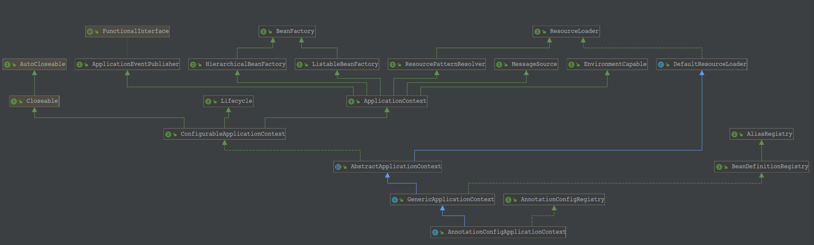

# Spring 注解方式启动过程
	首先看一下启动类 AnnotationConfigApplicationContext 的继承体系
   
## AnnotationConfigApplicationContext 解读
### 官方解释
		独立应用程序上下文，接受注解类作为输入，特别是 @Configuration 类，也接受普通的 @Component 类和使用 javax.inject 注解的
    JSR-330 兼容的类。允许使用 register(Class...) 逐个注册类，也允许使用 scan(String...) 扫描 classpath。
    	在含有多个 @Configuration 类的情况下，定义在后面的类中的 @Bean 方法将覆盖在前面的类中定义的 Bean。这可以作为一个
    使用额外的 @Configuration 类覆盖某些 Bean 定义的方法。
### 个人理解
		AnnotationConfigApplicationContext 中有两个属性：AnnotatedBeanDefinitionReader 和
    ClassPathBeanDefinitionScanner。而且 AnnotatedBeanDefinitionReader 是需要重点走查的，
    ClassPathBeanDefinitionScanner 不怎么使用。只有手动调用 scan(String...) 方法才会使用。
##### 
    程序启动入口：
```java
    /**
	 * Create a new AnnotationConfigApplicationContext, deriving bean definitions
	 * from the given annotated classes and automatically refreshing the context.
	 * @param annotatedClasses one or more annotated classes,
	 * e.g. {@link Configuration @Configuration} classes
	 */
	public AnnotationConfigApplicationContext(Class<?>... annotatedClasses) {
		this();
		// 注册配置类, annotatedClasses = CustomizeConfiguration.class
		register(annotatedClasses);
		refresh();
	}
```
    
    
    
    
    