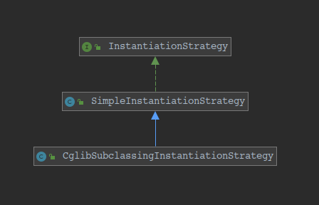

# Spring 注解方式启动过程
	首先看一下启动类 AnnotationConfigApplicationContext 的继承体系
   
## AnnotationConfigApplicationContext 解读
		独立应用程序上下文，接受注解类作为输入，特别是 @Configuration 类，也接受普通的 @Component 类和使用 javax.inject 注解的
    JSR-330 兼容的类。允许使用 register(Class...) 逐个注册类，也允许使用 scan(String...) 扫描 classpath。
    	在含有多个 @Configuration 类的情况下，定义在后面的类中的 @Bean 方法将覆盖在前面的类中定义的 Bean。这可以作为一个
    使用额外的 @Configuration 类覆盖某些 Bean 定义的方法。
		AnnotationConfigApplicationContext 中有两个属性：AnnotatedBeanDefinitionReader 和
    ClassPathBeanDefinitionScanner。而且 AnnotatedBeanDefinitionReader 是需要重点走查的，
    ClassPathBeanDefinitionScanner 不怎么使用。只有手动调用 scan(String...) 方法才会使用。
## AnnotationConfigRegistry 解读
	注解配置的应用程序上下文的通用接口, 定义了 register(java.lang.Class<?>...) 和 scan(java.lang.String...) 方法.
##### 
    1 程序启动入口：
```java
    /**
	 * Create a new AnnotationConfigApplicationContext, deriving bean definitions
	 * from the given annotated classes and automatically refreshing the context.
	 * @param annotatedClasses one or more annotated classes,
	 * e.g. {@link Configuration @Configuration} classes
	 */
	public AnnotationConfigApplicationContext(Class<?>... annotatedClasses) {
		this();
		// 注册配置类, annotatedClasses = CustomizeConfiguration.class
		register(annotatedClasses);
		refresh();
	}
```
    2 接着程序会进入 AnnotationConfigApplicationContext 的无参构造器
```java
	/**
	 * Create a new AnnotationConfigApplicationContext that needs to be populated
	 * through {@link #register} calls and then manually {@linkplain #refresh refreshed}.
	 */
	public AnnotationConfigApplicationContext() {
		super();
		this.reader = new AnnotatedBeanDefinitionReader(this);
		this.scanner = new ClassPathBeanDefinitionScanner(this);
	}
```
	3 进入 AnnotationConfigApplicationContext 的父类 GenericApplicationContext 的无参构造器
```java
	/**
	 * Create a new GenericApplicationContext.
	 * @see #registerBeanDefinition
	 * @see #refresh
	 */
	public GenericApplicationContext() {
		super();
		this.beanFactory = new DefaultListableBeanFactory();
	}
```
## GenericApplicationContext 解读
		泛型 ApplicationContext 实现, 它包含单个内部 DefaultListableBeanFactory 实例, 并且不假定特定的 bean 定义格式. 实现
    BeanDefinitionRegistry 接口以允许将任何 bean 定义读取器应用于它.
    	典型的用法是通过 BeanDefinitionRegistry 接口注册各种 bean 定义, 然后调用 AbstractApplicationContext.refresh()
    初始化那些具有应用程序上下文语义(处理 ApplicationContextAware, 自动检测 BeanFactoryPostProcessors 等)的 bean.
		用法示例:
```java
 GenericApplicationContext ctx = new GenericApplicationContext();
 XmlBeanDefinitionReader xmlReader = new XmlBeanDefinitionReader(ctx);
 xmlReader.loadBeanDefinitions(new ClassPathResource("applicationContext.xml"));
 PropertiesBeanDefinitionReader propReader = new PropertiesBeanDefinitionReader(ctx);
 propReader.loadBeanDefinitions(new ClassPathResource("otherBeans.properties"));
 ctx.refresh();

 MyBean myBean = (MyBean) ctx.getBean("myBean");
 ...
```
    	对于 XML bean 定义的典型情况, 只需要使用 ClassPathXmlApplicationContext 或 FileSystemXmlApplicationContext 更
    容易配置, 但不太灵活, 因为你只能使用 XML bean 定义的标准资源位置, 而不是混合任意 bean 定义格式. Web 环境中的等价物是
    XmlWebApplicationContext.
    	对于应该以可刷新的方法读取特殊 bean 定义格式的自定义应用程序上下文实现, 请考虑从 AbstractRefreshableApplicationContext
    基类派生.
## AliasRegistry 解读
	用于管理别名的的通用接口, 是 BeanDefinitionRegistry 接口的父接口.
## BeanDefinitionRegistry 解读
		持有 bean 定义的注册表接口, 如 RootBeanDefinition 和 ChildBeanDefinition 实例. 典型的实现是内部维持一个
    AbstractBeanDefinition 层次结构的 BeanFactories.
    	这是 Spring 工厂包中唯一封装 bean 定义注册的接口. 标准的 BeanFactory 接口仅涵盖对完全配置的工厂实例的访问.
        Spring 的 bean 定义读取器期望工作在这个接口的一个实现中. 已知的实现者是 DefaultListableBeanFactory 和
    GenericApplicationContext.
##### 
	4 进入 GenericApplicationContext 的父类 AbstractApplicationContext 的无参构造器
```java
	/**
	 * Create a new AbstractApplicationContext with no parent.
	 */
	public AbstractApplicationContext() {
		super();
		this.resourcePatternResolver = getResourcePatternResolver();
	}
```
## AbstractApplicationContext 解读
		ApplicationContext 接口的抽象实现. 不要求用于配置的存储类型; 只需要简单实现常见的上下文功能, 使用 Template Method 
    设计模式, 需要具体的子类来实现抽象方法.
    	与此相反, 一个朴素的 BeanFactory, ApplicationContext 应该检测定义在它内部的 bean factory 中的特定的 bean: 因此,
    这个类自动注册 BeanFactoryPostProcessors, BeanPostProcessors, and ApplicationListeners 作为 bean 在 context 中.
		MessageSource 也可以作为 bean 在 context 中提供, 名称为 "messageSource"; 否则, 消息解析委托给 parent context.
    此外, 应用程序时间的多播器可以作为一个类型为 ApplicationEventMulticaster 的 "applicationEventMulticaster" bean 提供
    在 context 中; 否则, 一个类型为 SimpleApplicationEventMulticaster 的多播器将被默认使用.
    	通过继承 DefaultResourceLoader 实现资源加载. 因此, 将非URL资源路径视为类路径资源(支持包含路径的完整类路径资源名称, 如
    "mypackage / myresource.dat"), 除非 DefaultResourceLoader.getResourceByPath(java.lang.String) 方法被子类重写.
## ConfigurableApplicationContext 解读
		SPI 接口由大多数 application context 实现. 除了 ApplicationContext 接口中的 application context 客户端方法之外,
    还提供配置 application context 的工具.
    	这里封装了 Configuration and lifecycle 方法. 避免它们相对于 ApplicationContext 客户端代码更明显. 本方法只能由启动
    和关闭代码使用.
## Lifecycle 解读
		定义启动/停止生命周期控制方法的通用接口. 这种情况的典型用例是控制异步处理. 注意: 此接口不暗示特定的自动启动语义, 可以考虑
    实现 SmartLifecycle 接口达成此目的.
    	可以被 components (通常是 Spring context 中定义的 Spring bean) 和 containers (通常是 Spring ApplicationContext
    本身) 实现. containers 会将启动/停止信号传播到每个 container 中的所有 components. 例如, 在运行时停止/重启 scenario.
    	请注意, Lifecycle 接口仅支持"顶级单例 beans". 在任何其它 component 中, Lifecycle 接口将不会被检测到而忽略. 另外,
    继承 SmartLifecycle 提供与 application context 的启动和关闭阶段的复杂集成.
## AutoCloseable 解读
		在关闭之前可以保存资源 (如, 文件, 套接字句柄) 的对象. 当退出资源规范头中已声明对象的 try-with-resources 语句块时, 将
    自动调用 AutoCloseable 对象的 close() 方法. 这种结构可以确保快速释放, 避免资源耗尽异常和可能发生的错误.
    	API 注意: 对于基类来说, 实现 AutoCloseable 是可能的, 并且实际上是常见的, 即使并非所有子类或实例都将保留可释放的资源.
    对于必须完全通用运行的代码, 或者当已知 AutoCloseable 实例需要资源释放时, 建议使用 try-with-resources 结构. 但是, 当使用
    Stream 支持基于 I/O 或非 I/O 的表单工具时, 在使用非基于 I/O 的表单时, 通常不需要使用 try-with-resources 语句块.
## Closeable 解读
	Closeable 是可以关闭的数据的来源或目标. 调用 close 方法以释放对象所持有的资源(如, 打开的文件).
## ApplicationContext 解读
    	用于为 application 提供配置的中央接口. 这在 application 运行时是只读的, 但是如果实现支持, 则可以重新加载.
        ApplicationContext 提供:
        	· Bean 工厂方法, 用于访问 application components. 继承自 ListableBeanFactory.
            · 以通用方式加载文件资源的能力. 继承自 ResourceLoader.
            · 将时间发布到已注册的监听器的功能. 继承自 ApplicationEventPublisher.
            · 解析消息, 支持国际化的能力. 继承自 MessageSource.
            · 继承 parent context. 后代 context 中的定义始终优先. 这意味着, 整个 Web application 可以使用单个
        parent context, 而每个 servlet 都有自己的子 context, 该 context 独立于任何其它 servlet 的子 context.
        
        除了标准的 BeanFactory 生命周期的能力, ApplicationContext 实现检测和调用 ApplicationContextAware beans,
    ResourceLoaderAware, ApplicationEventPublisherAware 和 MessageSourceAware beans.
## MessageSource 解读
    用于解析消息的策略接口, 支持此类消息的参数化和国际化.
    Spring 为生产提供了两种开箱即用的实现:
        · ResourceBundleMessageSource, 建立在标准的 ResourceBundle 之上.
        · ReloadableResourceBundleMessageSource, 能够重新加载消息定义而无需重启 VM.
## ApplicationEventPublisher 解读
    封装时间发布功能的接口. 作为 ApplicationContext 的父接口.
## EnvironmentCapable 解读
		一个包含和暴露出 Environment 引用的接口.
    	所有 Spring application 都是 EnvironmentCapable, 并且该接口主要用于 instanceof 在接受 BeanFactory 实例的框架方法中
    执行检查, 这些实例实际上也可能不是 ApplicationContext 实例, 以便在 environment 可用时与 environment 进行交互.
    	如上所述, ApplicationContext 继承了 EnvironmentCapable, 从而暴露出一个 getEnvironment() 方法; 然而,
    ConfigurableApplicationContext 重新定义了 getEnvironment() 和缩小签名以返回 ConfigurableEnvironment. 结果是, 在从
    ConfigurableApplicationContext 访问 Environment 对象之前, 它是"只读"的, 此时也可配置.
## BeanFactory 解读
    	用于访问 Spring bean 容器的 root 接口. 这是 bean 容器的基本客户端视图; 进一步的接口, 如 ListableBeanFactory 和
    ConfigurableBeanFactory, 可用于特定的目的.
    	此接口由包含许多 bean 定义的对象实现, 每个 bean 定义由 String 名称唯一标识. 根据 bean 定义, 工厂将返回包含对象的独立实例
    (Prototype 设计模式) 或单个共享实例 (Singleton 设计模式的高级替代, 其中实例是单例工厂范围). 将返回哪种类型的实例取决与 bean
    工厂配置: API 是相同的. 从 Spring 2.0 开始, 根据具体的 application context (如, Web 环境中 "request" and "session"
    范围), 可以使用更多的范围.
    	这种方法的重点是 BeanFactory 是 application component 的中央注册表, 并集中 application component 的配置(如, 不再
    需要单个对象读取属性文件). 有关此方法的优点的讨论, 请参见 《Expert One-on-One J2EE Design and Development》第4章和第11章.
    	请注意, 通常最好依靠依赖注入 ("push" 配置) 来通过 setter 或构造函数来配置应用程序对象, 而不是像 BeanFactory 查找一样使用
    任何形式的 "pull" 配置. Spring 的依赖注入功能是使用这个 BeanFactory 接口及其子接口实现的.
    	通常, BeanFactory 将加载存储在配置源 (如,XML 文档) 中的 bean 定义, 并使用 org.springframework.beans 包来配置 bean.
    但是, 实现可以直接在 Java 代码中返回它创建的 Java 对象. 对如何存储定义没有限制: LDAP, RDBMS, XML, properties 文件等. 鼓励
    实现支持 bean 之间的引用 (依赖注入).
    	与 ListableBeanFactory 中的方法相反, 如果是 HierarchicalBeanFactory, 此接口中的所有操作也将检查父工厂. 如果在此工厂
    的实例中找不到 bean, 则会询问直接父工厂. 此工厂实例中的 bean 应该在任何父工厂中覆盖同名的 bean.
    	Bean 工厂实现应尽可能支持标准 bean 生命周期接口. 完整的初始化方法及其标准顺序是:
        	1. BeanNameAware#setBeanName
        	2. BeanClassLoaderAware#setBeanClassLoader
        	3. BeanFactoryAware#setBeanFactory
        	4. EnvironmentAware#setEnvironment
        	5. EmbeddedValueResolverAware#setEmbeddedValueResolver
        	6. ResourceLoaderAware#setResourceLoader (仅适用于在 application context 中运行时)
        	7. ApplicationEventPublisherAware#setApplicationEventPublisher (仅适用于在 application context 中运行时)
        	8. MessageSourceAware#setMessageSource (仅适用于在 application context 中运行时)
        	9. ApplicationContextAware#setApplicationContext (仅适用于在 application context 中运行时)
        	10. ServletContextAware#setServletContext (仅适用于在 application context 中运行时)
        	11. BeanPostProcessors 中的 postProcessBeforeInitialization 方法
        	12. InitializingBean#afterPropertiesSet
        	13. 自定义的  init-method 定义
        	14. BeanPostProcessors 中的 postProcessAfterInitialization 方法
    	
        在关闭 bean 工厂时, 以下生命周期方法将被应用:
        	1. DestructionAwareBeanPostProcessors 中的 postProcessBeforeDestruction 方法
        	2. DisposableBean#destroy
        	3. 自定义的 destroy-method 定义
## ListableBeanFactory 解读
		BeanFactory 接口的扩展由 bean 工厂实现, 可以枚举所有的 bean 实例, 而不是按客户端的请求逐个尝试按名称查找 bean. 预加载所有
    bean 定义 (如, 基于 XML 的工厂) 的 BeanFactory 实现可以实现此接口.
    	如果是 HierarchicalBeanFactory, 则不会考虑加载任何 BeanFactory 层次结构中的 bean, 只是注册涉及当前工厂的 bean. 使用
    辅助类 BeanFactoryUtils 来考虑祖先工厂中的 bean.
    	此接口中的方法将仅考虑此工厂的 bean 定义. 它们会忽略通过其它手段 (如,  ConfigurableBeanFactory#registerSingleton 方法)
    注册的单例 beans, 除了手动注册的单例 beans 的 getBeanNamesOfType() 和 getBeansOfType() 之外. 当然, BeanFactory#getBean
    也允许同名访问这些特殊的 bean. 但是, 在典型的场景中, 所有 bean 定义将被定义在外部, 因此大多数应用程序不需要担心这种区别.
		注意: 除了 getBeanDefinitionCount and containsBeanDefinition 之外, 这个接口中的方法不是为了频繁调用而设计的, 执行可能
    很慢.
## HierarchicalBeanFactory 解读
		bean 工厂的子接口, 可以是层次结构的一部分.
    	bean 工厂中的 setParentBeanFactory 方法与 ConfigurableBeanFactory#setParentBeanFactory 相对应, 允许以可配置方式
    设置父级的 bean 工厂
## ResourceLoader 解读
		用于加载资源的策略接口（例如，类路径或文件系统资源）。ApplicationContext 需要提供这样的功能, 再加上扩展
    ResourcePatternResolver 支持.
    	DefaultResourceLoader 是一个独立的实现, 可以在 ApplicationContext 之外使用, 也可以使用 ResourceEditor.
    	使用特定 context 的资源加载策略, 在 ApplicationContext 中运行时, Resource 和 Resource 数组类型的 bean 属性可以从
    Strings 填充.
## ResourcePatternResolver 解读
		用于将 location pattern (如, Ant-style 路径模式) 解析为 Resource 对象的策略接口.
		这是 ResourceLoader 接口的扩展. 传入的 ResourceLoader (如, 在 context 中运行时 ApplicationContext 传入的
    ResourceLoaderAware) 可以检查它是否也实现了这个扩展接口
		PathMatchingResourcePatternResolver 是一个独立的实现，可以在 ApplicationContext 外部使用，也可以用于
    ResourceArrayPropertyEditor 填充 Resource 数组 bean 属性。
    	可以与任何类型的未知模式一起使用 (如, "/WEB-INF/*-context.xml"): 输入模式必须与策略实现模式相匹配. 此接口仅指定转换方法
    而不是特定的模式格式.
    	此接口还为类路径中的所有匹配资源建议新的资源前缀 "classpath*:". 请注意, 在这种情况下, 资源位置应该是没有占位符的路径 (如,
    "/beans.xml"); Jar 文件或类目录可以包含多个同名文件.
#### 
 	5 进入 AbstractApplicationContext 的父类 DefaultResourceLoader 的无参构造器
```java
	/**
	 * Create a new DefaultResourceLoader.
	 * <p>ClassLoader access will happen using the thread context class loader
	 * at the time of this ResourceLoader's initialization.
	 * @see java.lang.Thread#getContextClassLoader()
	 */
	public DefaultResourceLoader() {
		super();
        // sun.misc.Launcher.AppClassLoader 设置类加载器
		this.classLoader = ClassUtils.getDefaultClassLoader();
	}
```
## DefaultResourceLoader 解读
		ResourceLoader 接口的默认实现。使用于 ResourceEditor 和 作为  AbstractApplicationContext 的基类. 也可以单独使用.
		如果 location 值是一个 URL, 将返回 UrlResource; 如果是非 URL 路径或 "classpath:" 伪 URL 路径, 将返回
    ClassPathResource.
#### 
	6 通过 getResourcePatternResolver() 设置 resourcePatternResolver
```java
	/**
	 * Return the ResourcePatternResolver to use for resolving location patterns
	 * into Resource instances. Default is a
	 * {@link org.springframework.core.io.support.PathMatchingResourcePatternResolver},
	 * supporting Ant-style location patterns.
	 * <p>Can be overridden in subclasses, for extended resolution strategies,
	 * for example in a web environment.
	 * <p><b>Do not call this when needing to resolve a location pattern.</b>
	 * Call the context's {@code getResources} method instead, which
	 * will delegate to the ResourcePatternResolver.
	 * @return the ResourcePatternResolver for this context
	 * @see #getResources
	 * @see org.springframework.core.io.support.PathMatchingResourcePatternResolver
	 */
	protected ResourcePatternResolver getResourcePatternResolver() {
		// arg1 = AnnotationConfigApplicationContext
		return new PathMatchingResourcePatternResolver(this);
	}
```
    7 进入 PathMatchingResourcePatternResolver(ResourceLoader) 构造器
```java
	/**
	 * Create a new PathMatchingResourcePatternResolver.
	 * <p>ClassLoader access will happen via the thread context class loader.
	 * @param resourceLoader the ResourceLoader to load root directories and
	 * actual resources with
	 */
	public PathMatchingResourcePatternResolver(ResourceLoader resourceLoader) {
		// resourceLoader = AnnotationConfigApplicationContext
		super();
		Assert.notNull(resourceLoader, "ResourceLoader must not be null");
        // 设置资源加载器为 AnnotationConfigApplicationContext
		this.resourceLoader = resourceLoader;
	}
```
## PathMatchingResourcePatternResolver 解读
    	一个 ResourcePatternResolver 的实现, 能够将指定资源的 location path 解析为一个或多个 Resources. 源路径可以是与目标
    Resource 具有一对一映射的简单路径, 或者可以包含特殊的 "classpath*:" 前缀 and/or Ant-style 正则表达式 (使用 Spring 的
    AntPathMatcher 工具匹配). 后者都是有效的通配符.
    
    	没有通配符: 在简单的情况下, 如果指定的位置的路径不以 "classpath*:" 前缀开头, 并且不包含 PathMatcher 模式, 则此解析器将仅
    通过调用底层的 ResourceLoader#$getResource() 返回一个单独的资源. 如, 真实的 URLs(如, "file:C:/context.xml"), 伪 URLs
    (如, "classpath:/context.xml"), 简单的无前缀路径(如, "/WEB-INF/context.xml"). 后者将以特定于底层 ResourceLoader 的方式
    解析(如, ServletContextResource 用于 WebApplicationContext).
    
    	Ant-Style 模式: 当位置路径中包含 Ant-Style 模式时, 如:
```
 /WEB-INF/*-context.xml
 com/mycompany/**/applicationContext.xml
 file:C:/some/path/*-context.xml
 classpath:com/mycompany/**/applicationContext.xml
```
    	解析器将遵循一个更复杂但定义好的过程来尝试解析通配符. 它生成一个 Resource 直到最后一个非通配符段的路径并从中获取 URL. 如果
    URL 不是一个 "jar:" URL 或者容器专用的变种(如, WebLogic 的 "zip:", WebSphere 的 "wsjar" 等), 则从中获得一个 java.io.File.
    并通过遍历文件系统来解析通配符. 如果是一个 jar URL, 解析器从中获取一个 java.net.JarURLConnection, 或者手动解析这个 jar URL,
    然后遍历 jar 文件内容, 以解析通配符.
    
    	可移植性启示:
        	如果指定的路径已经是文件 URL(显示或隐式, 因为 base ResourceLoader 是文件系统), 那么通配符保证以完全可移植的方式工作.
    		如果指定的路径是类路径位置, 则解析器必须通过调用 Classloader.getResource() 来获得最后一段非通配符路径 URL. 由于这只是
        路径的一个节点 (不是最后的文件), 因此在这种情况下, 实际上未定义 (在 ClassLoader 中) 究竟返回了什么类型的 URL. 实际上, 它通
        常是一个代表目录的 java.io.File (意味着 classpath 资源解析为文件系统位置), 或者某种类型的 jar URL (意味着 classpath 资
        源解析为文件 jar 位置). 尽管如此, 这个操作仍然存在可移植性问题.
    
    	"classpath*:" 前缀:
    		特别支持通过 "classpath*:" 前缀检索具有相同名称的多个类路径资源. 如, "classpath*:META-INF/beans.xml" 将在类路径中
        找到所有的 "bean.xml" 文件, 无论是在 "classes" 目录还是 jar 文件中. 这对于在每个 jar 文件中的相同位置自动检测同名的配置文
        件特备有用. 在内部, 这通过调用 Classloader.getResources() 发生, 并且完全可移植.
        	"classpath*:" 前缀也可以与位置路径的其余部分中的 PathMatcher 模式组合. 如, "classpath*:META-INF/*-bean.xml". 在
        这种情况下, 解析策略非常简单: 在最后一个非通配符路径段上 调用 Classloader.getResources() 来获取类加载器层次结构中的所有匹配
        资源. 然后关闭每个资源, 使用与上述相同的解析策略的 PathMatcher 解析通配符子路径.
        
        其它说明:
        	警告: 请注意, "classpath*:" 与 Ant-style 模式结合使用时, 只能在模式启动前与至少一个根目录可靠地工作, 除非实际目标文件
        驻留在文件系统中. 这意味着 "classpath*:*.xml" 这样的模式不会从 jar 文件的根目录中检索文件, 而只能从扩展目录的根目录中检索文
        件. 这源于 JDK Classloader.getResources() 方法的限制, 该方法仅在传入空字符串时返回文件系统位置(指示搜索的潜在根).
        ResourcePatternResolver 实现尝试通过 URLClassloader 自我检查和 "java.class.path" 清单评估来缓解 jar 根查找限制; 但是,
        没有可移植性保证.
        	警告: 如果要搜索的根包在多个类路径中可用, 则不保证具有 "classpath:" 资源的 Ant-Style 模式可以找到匹配的资源. 这是因为
        资源如 "com/mycompany/package1/service-context.xml", 可能只在一个位置, 但是当一个路径如
        "classpath:com/mycompany/**/service-context.xml", 被用于尝试解析时, 解析器将工作在 getResource("com/mycompany")
        返回的 (第一个) URL 上; 如果基本包节点不存在于多个类加载器位置中, 则实际的最终资源可能不再下面. 因此, 在这样的情况下, 使用的
        "classpath*:" 最好与 Ant-style 模式一致, 这将搜索包含根路径的所有类路径位置.
#### 
	8 PathMatchingResourcePatternResolver 初始化 pathMatcher 属性
```java
	private PathMatcher pathMatcher = new AntPathMatcher();
    
    /**
	 * Create a new instance with the {@link #DEFAULT_PATH_SEPARATOR}.
	 */
	public AntPathMatcher() {
    	// 设置路径分隔符, 默认为 "/"
		this.pathSeparator = DEFAULT_PATH_SEPARATOR;
        // 设置路径分隔符模式缓存
		this.pathSeparatorPatternCache = new PathSeparatorPatternCache(DEFAULT_PATH_SEPARATOR);
	}
    
    // PathSeparatorPatternCache 是 AntPathMatcher 的 private 内部类
    public PathSeparatorPatternCache(String pathSeparator) {
        this.endsOnWildCard = pathSeparator + "*";
        this.endsOnDoubleWildCard = pathSeparator + "**";
    }
    
```
## PathMatcher 解读
		基于 String 路径匹配的策略接口.
        使用于 PathMatchingResourcePatternResolver, AbstractUrlHandlerMapping, and WebContentInterceptor.
        默认实现是 AntPathMatcher, 支持 Ant-style 模式语法.
## AntPathMatcher 解读
		Ant-Style 路径模式的 PathMathcer 实现.
        部分映射代码从 Apache Ant 中借用.
        映射使用以下规则匹配 URL:
        	· ? 匹配一个字符
            · * 匹配一个或多个字符
            · ** 匹配路径上的一个或多个目录
            · {spring: [a-z]+} 匹配正则表达式 [a-z]+ 作为一个变量名为 spring 的路径.
    	例子:
        	· com/t?st.jsp  	--->   	com/test.jsp | com/tast.jsp | com/txst.jsp
            · com/*.jsp     	--->   	com 目录中的所有 jsp 文件
            · com/**/test.jsp	--->	com 路径下的所有 test.jsp 文件
            · org/springframework/**/*.jsp	--->	org/springframework 路径下的所有 jsp 文件
            · org/**/servlet/bla.jsp		--->	org/springframework/servlet/bla.jsp | org/servlet/bla.jsp |
        org/springframework/testing/servlet/bla.jsp
        	· com/{filename:\\w+}.jsp		--->	匹配 com/test.jsp 并且将变量 filename 赋值为 "test"
    
    	注意: 模式和路径必须都是绝对的或者相对的, 以便两者匹配. 因此, 建议此实现的用户清理模式, 以便在它们使用的 context 中使用 "/"
    作为前缀.
#### 
    9 设置 GenericApplicationContext 的 beanFactory
```java
	/**
	 * Create a new GenericApplicationContext.
	 * @see #registerBeanDefinition
	 * @see #refresh
	 */
	public GenericApplicationContext() {
		super();
		this.beanFactory = new DefaultListableBeanFactory();
	}
    
    // 进入 DefaultListableBeanFactory 的无参构造器
    /**
	 * Create a new DefaultListableBeanFactory.
	 */
	public DefaultListableBeanFactory() {
		super();
	}
    
    // 初始化 DefaultListableBeanFactory 的 autowireCandidateResolver 属性
    /** Resolver to use for checking if a bean definition is an autowire candidate. */
	private AutowireCandidateResolver autowireCandidateResolver = new SimpleAutowireCandidateResolver();
    
    // 进入 SimpleAutowireCandidateResolver 的无参构造器 (JDK 默认提供)
    
```
    AutowireCandidateResolver 的继承体系

## AutowireCandidateResolver 解读
    用于确定特定 bean 定义是否有资格作为特定依赖关系的自动线候选的策略接口。
## SimpleAutowireCandidateResolver 解读
	AutowireCandidateResolver 没有注释支持时使用的实现。此实现仅检查 bean 定义。
#### 
    10 进入 DefaultListableBeanFactory 的父类 AbstractAutowireCapableBeanFactory 的无参构造器
```java
	/**
	 * Create a new AbstractAutowireCapableBeanFactory.
	 */
	public AbstractAutowireCapableBeanFactory() {
		super();
		ignoreDependencyInterface(BeanNameAware.class);
		ignoreDependencyInterface(BeanFactoryAware.class);
		ignoreDependencyInterface(BeanClassLoaderAware.class);
	}
    
    // 首先初始化 AbstractAutowireCapableBeanFactory 的属性
    /** Strategy for creating bean instances. */
	private InstantiationStrategy instantiationStrategy = new CglibSubclassingInstantiationStrategy();
	/** Resolver strategy for method parameter names. */
	@Nullable
	private ParameterNameDiscoverer parameterNameDiscoverer = new DefaultParameterNameDiscoverer();
```
    CglibSubclassingInstantiationStrategy 继承体系

## CglibSubclassingInstantiationStrategy 解读
    在 BeanFactories 中使用的对象实例化的默认策略.
    如果容器需要覆盖方法以实现方法注入, 则使用 CGLIB 动态生成子类.
## SimpleInstantiationStrategy 解读
    在 BeanFactories 中使用的对象实例化的简单策略.
    不支持方法注入, 尽管它提供了子类的 hooks 来覆盖以添加方法注入支持, 如通过重写方法.
## InstantiationStrategy 解读
	负责创建与 root bean 定义相对应的实例接口.
    随着各种方法的实现, 这被拉入战略, 包括使用 CGLIB 动态创建子类支持方法注入.
#### 
    DefaultParameterNameDiscoverer 继承体系

## DefaultParameterNameDiscoverer 解读
    	ParameterNameDiscoverer 策略接口的默认实现, 使用 Java 8 标准反射机制 (如果可用), 并回退到基于 ASM 的
    LocalVariableTableParameterNameDiscoverer, 以检查类文件中的调试信息.
    	如果存在 Kotlin 反射实现, 则首先在列表中添加 KotlinReflectionParameterNameDiscoverer, 并用于 Kotlin 类和接口.
    当编译和运行一个 Graal 本地图片时, 没有 ParameterNameDiscoverer 被使用.
    	可以通过 PrioritizedParameterNameDiscoverer.addDiscoverer(ParameterNameDiscoverer) 添加更多的发现者.
## PrioritizedParameterNameDiscoverer 解读
    	ParameterNameDiscoverer 实现连续尝试几个发现者委托. 首先在 addDiscoverer 方法中添加的那些具有最高优先级.
    如果一个返回 null, 则将尝试下一个.
    	如果没有 discoverer 匹配, 默认返回 null.
## ParameterNameDiscoverer 解读
    	用于发现方法和构造器的参数名称的接口.
        参数名称发现并不总是可行，但可以尝试各种策略，例如查找可能在编译时发出的调试信息，以及查找可选的 AspectJ 注解方法的 argname
    注解值。
#### 
	11 添加忽略依赖接口
```java
	/**
	 * Create a new AbstractAutowireCapableBeanFactory.
	 */
	public AbstractAutowireCapableBeanFactory() {
		super();
		ignoreDependencyInterface(BeanNameAware.class);
		ignoreDependencyInterface(BeanFactoryAware.class);
		ignoreDependencyInterface(BeanClassLoaderAware.class);
	}
	/**
	 * 忽略给定的自动装配依赖接口。
	 * 这通常由 application context 用于注册以其他方式解析的依赖关系，
	 * 例如 BeanFactory 通过 BeanFactoryAware 或 ApplicationContext 通过 ApplicationContextAware。
	 * 默认情况下，仅忽略 BeanFactoryAware 接口。要忽略其他类型，请为每种类型调用此方法。
	 *
	 * @see org.springframework.beans.factory.BeanFactoryAware
	 * @see org.springframework.context.ApplicationContextAware
	 */
	public void ignoreDependencyInterface(Class<?> ifc) {
		this.ignoredDependencyInterfaces.add(ifc);
	}
    /**
	 * Dependency interfaces to ignore on dependency check and autowire, as Set of
	 * Class objects. By default, only the BeanFactory interface is ignored.
	 */
	private final Set<Class<?>> ignoredDependencyInterfaces = new HashSet<>();
```
    12 进入 AnnotatedBeanDefinitionReader(BeanDefinitionRegistry) 构造器
```java
	/**
	 * Create a new {@code AnnotatedBeanDefinitionReader} for the given registry.
	 * If the registry is {@link EnvironmentCapable}, e.g. is an {@code ApplicationContext},
	 * the {@link Environment} will be inherited, otherwise a new
	 * {@link StandardEnvironment} will be created and used.
	 * @param registry the {@code BeanFactory} to load bean definitions into,
	 * in the form of a {@code BeanDefinitionRegistry}
	 * @see #AnnotatedBeanDefinitionReader(BeanDefinitionRegistry, Environment)
	 * @see #setEnvironment(Environment)
	 */
	public AnnotatedBeanDefinitionReader(BeanDefinitionRegistry registry) {
		// registry = AnnotationConfigApplicationContext
		// arg0 = AnnotationConfigApplicationContext, arg1 = StandardEnvironment
		this(registry, getOrCreateEnvironment(registry));
	}
    // 初始化 AnnotatedBeanDefinitionReader 的属性
    private BeanNameGenerator beanNameGenerator = new AnnotationBeanNameGenerator();

	private ScopeMetadataResolver scopeMetadataResolver = new AnnotationScopeMetadataResolver();
```
## AnnotationBeanNameGenerator 解读
		BeanNameGenerator 实例用于生成 bean classes 的 beanName, beans classes 上有如下注解声明:
        	1. @Component 注解
        	2. 以 @Component 作为元注解的注解
    	如, Spring 的 stereotype 注解(如, @Repository), 它本身有 @Component 注解声明.
        还支持 JavaEE 6 的 ManagedBean 和 JSR-330 的 Named 注解(如果可用). 请注意, Spring component 注解总是覆盖这些标准
    注解.
    	如果注解的 value 没有设置一个 beanName, 则根据类的短名称 (第一个字母为小写) 构建适当的 beanName. 如:
```
com.xyz.FooServiceImpl -> fooServiceImpl
```
## BeanNameGenerator 解读
    用于为 bean 定义生成 beanName 的策略接口.
#### 
    13 进入 AnnotationScopeMetadataResolver 的无参构造器
```java
	/**
	 * Construct a new {@code AnnotationScopeMetadataResolver}.
	 * @see #AnnotationScopeMetadataResolver(ScopedProxyMode)
	 * @see ScopedProxyMode#NO
	public AnnotationScopeMetadataResolver() {
    	// 设置 defaultProxyMode 属性
		this.defaultProxyMode = ScopedProxyMode.NO;
	}
```
## AnnotationScopeMetadataResolver 解读
    ScopeMetadataResolver 实现, 默认情况下检查 bean 类上是否存在 Spring 的 @Scope 注解.
    检查的确切的注解类型可通过 setScopeAnnotationType(Class) 配置.
## ScopeMetadataResolver 解读
	用于解析 bean 定义范围的策略接口.
## ScopedProxyMode 解读
	枚举各种范围代理选项.
    有关 scoped proxy 的确切内容的更全面的讨论, 请参阅 Spring 参考文档的 'Scoped beans as dependencies' 部分.
## ScopeMetadata 解读
    描述 Spring 管理的 bean 的 scope 特征, 包括范围名称和范围代理的行为.
    默认的 Scope 是 "singleton", 默认情况下不创建 scoped-proxy.
#### 
    14 回到 AnnotatedBeanDefinitionReader(BeanDefinitionRegistry) 构造器
```java
	/**
	 * 使用给定的 registry 创建一个 AnnotatedBeanDefinitionReader.
	 * 如果 registry 是 EnvironmentCapable (如, ApplicationContext),
	 * Environment 将被遗传, 否则将使用一个 StandardEnvironment
	 * @param registry the {@code BeanFactory} to load bean definitions into,
	 * in the form of a {@code BeanDefinitionRegistry}
	 * @see #AnnotatedBeanDefinitionReader(BeanDefinitionRegistry, Environment)
	 * @see #setEnvironment(Environment)
	 */
	public AnnotatedBeanDefinitionReader(BeanDefinitionRegistry registry) {
		// registry = AnnotationConfigApplicationContext
		// arg0 = AnnotationConfigApplicationContext, arg1 = StandardEnvironment
		this(registry, getOrCreateEnvironment(registry));
	}
    /**
	 * Get the Environment from the given registry if possible, otherwise return a new
	 * StandardEnvironment.
	 */
	private static Environment getOrCreateEnvironment(BeanDefinitionRegistry registry) {
		// registry = AnnotationConfigApplicationContext
		Assert.notNull(registry, "BeanDefinitionRegistry must not be null");
		if (registry instanceof EnvironmentCapable) {
			return ((EnvironmentCapable) registry).getEnvironment();
		}
		return new StandardEnvironment();
	}
    /**
	 * Create a new {@code AnnotatedBeanDefinitionReader} for the given registry and using
	 * the given {@link Environment}.
	 * @param registry the {@code BeanFactory} to load bean definitions into,
	 * in the form of a {@code BeanDefinitionRegistry}
	 * @param environment the {@code Environment} to use when evaluating bean definition
	 * profiles.
	 * @since 3.1
	 */
	public AnnotatedBeanDefinitionReader(BeanDefinitionRegistry registry, Environment environment) {
		// registry = AnnotationConfigApplicationContext, environment = StandardEnvironment
		Assert.notNull(registry, "BeanDefinitionRegistry must not be null");
		Assert.notNull(environment, "Environment must not be null");
		this.registry = registry;
		// arg0 = AnnotationConfigApplicationContext, arg1 = StandardEnvironment, arg2 = null
		this.conditionEvaluator = new ConditionEvaluator(registry, environment, null);
		// 这个方法的核心就是注册Spring内置的多个Bean
		// 这里仅仅是注册，可以简单的理解为把一些原料放入工厂，工厂还没有真正的去生产。
		AnnotationConfigUtils.registerAnnotationConfigProcessors(this.registry);
	}
    /**
	 * Create a new {@link ConditionEvaluator} instance.
	 */
	public ConditionEvaluator(@Nullable BeanDefinitionRegistry registry,
			@Nullable Environment environment, @Nullable ResourceLoader resourceLoader) {
		// arg0 = AnnotationConfigApplicationContext, arg1 = StandardEnvironment, arg2 = null
		this.context = new ConditionContextImpl(registry, environment, resourceLoader);
	}
    public ConditionContextImpl(@Nullable BeanDefinitionRegistry registry,
            @Nullable Environment environment, @Nullable ResourceLoader resourceLoader) {
        // registry = AnnotationConfigApplicationContext,
        // environment = StandardEnvironment, resourceLoader = null
        this.registry = registry;
        // 推断 beanFactory ，arg0 = AnnotationConfigApplicationContext
        this.beanFactory = deduceBeanFactory(registry);
        this.environment = (environment != null ? environment : deduceEnvironment(registry));
        // 推断 resourceLoader，arg0 = AnnotationConfigApplicationContext
        this.resourceLoader = (resourceLoader != null ? resourceLoader : deduceResourceLoader(registry));
        // 推断 classLoader，arg0 = null, arg1 = DefaultListableBeanFactory
        this.classLoader = deduceClassLoader(resourceLoader, this.beanFactory);
    }
    @Nullable
    private ConfigurableListableBeanFactory deduceBeanFactory(@Nullable BeanDefinitionRegistry source) {
		// source = AnnotationConfigApplicationContext
        if (source instanceof ConfigurableListableBeanFactory) {
            return (ConfigurableListableBeanFactory) source;
        }
        // true
        if (source instanceof ConfigurableApplicationContext) {
			// DefaultListableBeanFactory
            return (((ConfigurableApplicationContext) source).getBeanFactory());
        }
        return null;
    }
    private ResourceLoader deduceResourceLoader(@Nullable BeanDefinitionRegistry source) {
		// source = AnnotationConfigApplicationContext
        if (source instanceof ResourceLoader) {
            return (ResourceLoader) source;
        }
        return new DefaultResourceLoader();
	}
    @Nullable
    private ClassLoader deduceClassLoader(@Nullable ResourceLoader resourceLoader,
            @Nullable ConfigurableListableBeanFactory beanFactory) {
		// resourceLoader = null, beanFactory = DefaultListableBeanFactory
        if (resourceLoader != null) {
            ClassLoader classLoader = resourceLoader.getClassLoader();
            if (classLoader != null) {
                return classLoader;
            }
        }
		// true
        if (beanFactory != null) {
			// sun.misc.Launcher.AppClassLoader
            return beanFactory.getBeanClassLoader();
        }
        return ClassUtils.getDefaultClassLoader();
    }
    
```
#### 
    15 进入 AnnotationConfigUtils#registerAnnotationConfigProcessors(BeanDefinitionRegistry)
```java
	/**
	 * 在给定的注册器中注册所有向应的 注解后处理器
	 * @param registry the registry to operate on
	 */
	public static void registerAnnotationConfigProcessors(BeanDefinitionRegistry registry) {
		// registry = AnnotationConfigApplicationContext
		// arg0 = AnnotationConfigApplicationContext, arg1 = null
		registerAnnotationConfigProcessors(registry, null);
	}
    /**
	 * Register all relevant annotation post processors in the given registry.
	 * @param registry the registry to operate on
	 * @param source the configuration source element (already extracted)
	 * that this registration was triggered from. May be {@code null}.
	 * @return a Set of BeanDefinitionHolders, containing all bean definitions
	 * that have actually been registered by this call
	 */
	public static Set<BeanDefinitionHolder> registerAnnotationConfigProcessors(
			BeanDefinitionRegistry registry, @Nullable Object source) {
		// registry = AnnotationConfigApplicationContext, source = null
		// DefaultListableBeanFactory
		DefaultListableBeanFactory beanFactory = unwrapDefaultListableBeanFactory(registry);
		// true
		if (beanFactory != null) {
			// true
			if (!(beanFactory.getDependencyComparator() instanceof AnnotationAwareOrderComparator)) {
				beanFactory.setDependencyComparator(AnnotationAwareOrderComparator.INSTANCE);
			}
			if (!(beanFactory.getAutowireCandidateResolver() instanceof
            		ContextAnnotationAutowireCandidateResolver)) {
				beanFactory.setAutowireCandidateResolver(new ContextAnnotationAutowireCandidateResolver());
			}
		}

		// 加入了一堆默认的 BeanDefinitionHolder
		Set<BeanDefinitionHolder> beanDefs = new LinkedHashSet<>(8);

		// true
		if (!registry.containsBeanDefinition(CONFIGURATION_ANNOTATION_PROCESSOR_BEAN_NAME)) {
			// 这个 Bean 的注册是最重要的。
			RootBeanDefinition def = new RootBeanDefinition(ConfigurationClassPostProcessor.class);
			def.setSource(source);
			// BeanDefinitionHolder
			beanDefs.add(registerPostProcessor(registry, def, CONFIGURATION_ANNOTATION_PROCESSOR_BEAN_NAME));
		}

		if (!registry.containsBeanDefinition(AUTOWIRED_ANNOTATION_PROCESSOR_BEAN_NAME)) {
			RootBeanDefinition def = new RootBeanDefinition(AutowiredAnnotationBeanPostProcessor.class);
			def.setSource(source);
			beanDefs.add(registerPostProcessor(registry, def, AUTOWIRED_ANNOTATION_PROCESSOR_BEAN_NAME));
		}

		// Check for JSR-250 support, and if present add the CommonAnnotationBeanPostProcessor.
		if (jsr250Present && !registry.containsBeanDefinition(COMMON_ANNOTATION_PROCESSOR_BEAN_NAME)) {
			RootBeanDefinition def = new RootBeanDefinition(CommonAnnotationBeanPostProcessor.class);
			def.setSource(source);
			beanDefs.add(registerPostProcessor(registry, def, COMMON_ANNOTATION_PROCESSOR_BEAN_NAME));
		}

		// Check for JPA support, and if present add the PersistenceAnnotationBeanPostProcessor.
		if (jpaPresent && !registry.containsBeanDefinition(PERSISTENCE_ANNOTATION_PROCESSOR_BEAN_NAME)) {
			RootBeanDefinition def = new RootBeanDefinition();
			try {
				def.setBeanClass(ClassUtils.forName(PERSISTENCE_ANNOTATION_PROCESSOR_CLASS_NAME,
						AnnotationConfigUtils.class.getClassLoader()));
			}
			catch (ClassNotFoundException ex) {
				throw new IllegalStateException(
						"Cannot load optional framework class: " + PERSISTENCE_ANNOTATION_PROCESSOR_CLASS_NAME, ex);
			}
			def.setSource(source);
			beanDefs.add(registerPostProcessor(registry, def, PERSISTENCE_ANNOTATION_PROCESSOR_BEAN_NAME));
		}

		if (!registry.containsBeanDefinition(EVENT_LISTENER_PROCESSOR_BEAN_NAME)) {
			RootBeanDefinition def = new RootBeanDefinition(EventListenerMethodProcessor.class);
			def.setSource(source);
			beanDefs.add(registerPostProcessor(registry, def, EVENT_LISTENER_PROCESSOR_BEAN_NAME));
		}

		if (!registry.containsBeanDefinition(EVENT_LISTENER_FACTORY_BEAN_NAME)) {
			RootBeanDefinition def = new RootBeanDefinition(DefaultEventListenerFactory.class);
			def.setSource(source);
			beanDefs.add(registerPostProcessor(registry, def, EVENT_LISTENER_FACTORY_BEAN_NAME));
		}

		return beanDefs;
	}
```
## AnnotationConfigUtils 解读
    
    
    
    
    
    
    
```java

```
    
    
    
    

    
    
    
    
    
    
    
    
    
    
    
    
    
    
    
    
    
    
    
    
    
    
    
    
    
    
    
    
    
    
    
    
    
    
    
    
    
    