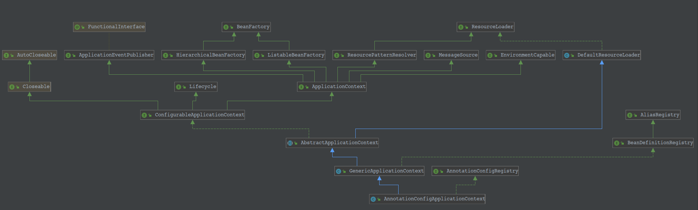

[TOC]

**AnnotationConfigApplicationContext 继承体系**


## AnnotationConfigApplicationContext 解读
		独立应用程序上下文，接受注解类作为输入，特别是 @Configuration 类，也接受普通的 @Component 类和使用
    javax.inject 注解的JSR-330 兼容的类。允许使用 register(Class...) 逐个注册类，也允许使用 scan(String...)
    扫描 classpath。
    	在含有多个 @Configuration 类的情况下，定义在后面的类中的 @Bean 方法将覆盖在前面的类中定义的 Bean。这可以作为
    一个使用额外的 @Configuration 类覆盖某些 Bean 定义的方法。
		AnnotationConfigApplicationContext 中有两个属性：AnnotatedBeanDefinitionReader 和
    ClassPathBeanDefinitionScanner。而且 AnnotatedBeanDefinitionReader 是需要重点走查的，
    ClassPathBeanDefinitionScanner 不怎么使用。只有手动调用 scan(String...) 方法才会使用。
## AnnotationConfigRegistry 解读
		注解配置的应用程序上下文的通用接口, 定义了 register(java.lang.Class<?>...) 和 scan(java.lang.String...)
    方法.
## GenericXmlApplicationContext 解读
		方便的应用程序上下文，内置XML支持。这是ClassPathXmlApplicationContext和FileSystemXmlApplicationContext
    的灵活替代方案，可通过setter配置，最终AbstractApplicationContext.refresh（）调用激活上下文。
    	如果有多个配置文件，以后文件中的bean定义将覆盖早期文件中定义的bean定义。这可以用于通过附加到列表的额外配置文件
    有意覆盖某些bean定义。
## AnnotatedBeanDefinitionReader 解读
		方便的适配器，用于注释bean类的编程注册。这是ClassPathBeanDefinitionScanner的替代方法，应用相同的注释分辨率，
    但仅适用于显式注册的类。
## AnnotationBeanNameGenerator 解读
	BeanNameGenerator 实例用于生成 bean classes 的 beanName, beans classes 上有如下注解声明:
        	1. @Component 注解
        	2. 以 @Component 作为元注解的注解
    	如, Spring 的 stereotype 注解(如, @Repository), 它本身有 @Component 注解声明.
        还支持 JavaEE 6 的 ManagedBean 和 JSR-330 的 Named 注解(如果可用). 请注意, Spring component 注解总是
    覆盖这些标准注解.
    	如果注解的 value 没有设置一个 beanName, 则根据类的短名称 (第一个字母为小写) 构建适当的 beanName. 如:
```java
com.xyz.FooServiceImpl -> fooServiceImpl
```
## BeanNameGenerator 解读
		用于为 bean 定义生成 beanName 的策略接口.
## AnnotationScopeMetadataResolver 解读
		ScopeMetadataResolver 实现, 默认情况下检查 bean 类上是否存在 Spring 的 @Scope 注解.
    	检查的确切的注解类型可通过 setScopeAnnotationType(Class) 配置.
## ScopeMetadataResolver 解读
		用于解析 bean 定义范围的策略接口.
## ScopedProxyMode 解读
		枚举各种范围代理选项.
    	有关 scoped proxy 的确切内容的更全面的讨论, 请参阅 Spring 参考文档的 'Scoped beans as dependencies' 部分.

    枚举值:
    	DEFAULT:
        	除非在组件扫描指令级别配置了不同的默认值，否则默认值通常等于NO。

        NO:
        	不要创建范围代理。
            当与非单例作用域实例一起使用时，此代理模式通常不常用，如果要将其用作依赖项，则应优先使用INTERFACES或
        TARGET_CLASS代理模式。

		INTERFACES:
        	创建一个JDK动态代理，实现目标对象的类所公开的所有接口。

		TARGET_CLASS:
        	创建基于类的代理（使用CGLIB）。
## ClassPathBeanDefinitionScanner 解读
		一个bean定义扫描程序，它检测类路径上的bean候选者，使用给定的注册表（BeanFactory或ApplicationContext）
    注册相应的bean定义。
		通过可配置的类型过滤器检测候选类。默认过滤器包括使用Spring的@ Component，@ Repository，@ Service 或
    @Controller构造型注释的类。
    	还支持Java EE 6的ManagedBean和JSR-330的 Named 注释（如果可用）。
## BeanDefinitionRegistry 解读
		持有 bean 定义的注册表接口, 如 RootBeanDefinition 和 ChildBeanDefinition 实例. 典型的实现是内部维持
    一个AbstractBeanDefinition 层次结构的 BeanFactories.
		这是 Spring 工厂包中唯一封装 bean 定义注册的接口. 标准的 BeanFactory 接口仅涵盖对完全配置的工厂实例的访问.
    	Spring 的 bean 定义读取器期望工作在这个接口的一个实现中. 已知的实现者是 DefaultListableBeanFactory 和
	GenericApplicationContext.
## AliasRegistry 解读
		用于管理别名的的通用接口, 是 BeanDefinitionRegistry 接口的父接口.
## BeanDefinition 解读
		BeanDefinition描述了一个bean实例，它具有属性值，构造函数参数值以及具体实现提供的更多信息。
        这只是一个最小的接口：主要目的是允许BeanFactoryPostProcessor（如PropertyPlaceholderConfigurer）内省和
    修改属性值和其他bean元数据。
## BeanFactoryPostProcessor 解读
		允许自定义修改应用程序上下文的bean定义，调整上下文的基础bean工厂的bean属性值。
        应用程序上下文可以在其bean定义中自动检测BeanFactoryPostProcessor bean，并在创建任何其他bean之前应用它们。
        对于以系统管理员为目标的自定义配置文件非常有用，这些文件覆盖在应用程序上下文中.
        请参阅PropertyResourceConfigurer及其针对此类配置需求的开箱即用解决方案的具体实现。
        BeanFactoryPostProcessor可以与bean定义交互并修改bean定义，但绝不能与bean实例交互。这样做可能会导致bean
    过早实例化，违反容器并导致意外的副作用。如果需要bean实例交互，请考虑实现BeanPostProcessor。
## BeanPostProcessor 解读
		工厂钩子，允许自定义修改新的bean实例，例如检查标记接口或用代理包装它们。
        ApplicationContexts可以在其bean定义中自动检测BeanPostProcessor bean，并将它们应用于随后创建的任何bean。
    普通 Bean 工厂允许对后处理器进行编程注册，适用于通过该工厂创建的所有bean。
    	通常，通过标记接口等填充bean的后处理器将实现postProcessBeforeInitialization（java.lang.Object，
    java.lang.String），而使用代理包装bean的后处理器通常会实现
	postProcessAfterInitialization（java.lang.Object），java.lang.String）。
## InstantiationAwareBeanPostProcessor 解读
		BeanPostProcessor的子接口，用于添加实例化前回调，实例化后但在显式属性设置或自动装配发生之前的回调。
        通常用于抑制特定目标bean的默认实例化，例如创建具有特殊TargetSource的代理（池化目标，延迟初始化目标等），或
    实现其他注入策略（如字段注入）。
    	注意：此接口是一个专用接口，主要供框架内部使用。建议尽可能实现普通的BeanPostProcessor接口，或者从
    InstantiationAwareBeanPostProcessorAdapter派生，以防止对此接口的扩展。
## InstantiationAwareBeanPostProcessorAdapter 解读
		将SmartInstantiationAwareBeanPostProcessor上的所有方法实现为no-ops的适配器，它不会更改容器实例化的每个
    bean的正常处理。子类可以仅覆盖它们实际感兴趣的那些方法。
    	请注意，仅当您确实需要InstantiationAwareBeanPostProcessor功能时，才建议使用此基类。如果您只需要简单的
    BeanPostProcessor功能，则更喜欢该（更简单）接口的直接实现。
## SmartInstantiationAwareBeanPostProcessor 解读
		扩展InstantiationAwareBeanPostProcessor接口，添加一个回调以预测已处理bean的最终类型。
        注意：此接口是一个专用接口，主要供框架内部使用。通常，应用程序提供的后处理器应该只实现普通的BeanPostProcessor
    接口，或者从InstantiationAwareBeanPostProcessorAdapter类派生。即使在点发行版中，也可能会向此接口添加新方法。
## ProxyProcessorSupport 解读
		BeanPostProcessor实现，它使用AOP代理包装每个符合条件的bean，在调用bean本身之前委托给指定的拦截器。
        此类区分“常见”拦截器：为其创建的所有代理共享，以及“特定”拦截器：每个bean实例唯一。不需要任何常见的拦截器。如果有，
    则使用interceptorNames属性设置它们。与ProxyFactoryBean一样，使用当前工厂中的拦截器名称而不是bean引用来允许正确处
    理原型顾问程序和拦截器：例如，支持有状态的mixin。“interceptorNames”条目支持任何建议类型。
    	如果存在大量需要用类似代理包装的bean，即委托给相同的拦截器，则这种自动代理特别有用。而不是x目标bean的x重复代理
    定义，您可以使用bean工厂注册一个这样的后处理器以实现相同的效果。
    	子类可以应用任何策略来决定是否要代理bean，例如按类型，按名称，按定义细节等。它们还可以返回应该只应用于特定bean
    实例的其他拦截器。一个简单的具体实现是BeanNameAutoProxyCreator，通过给定的名称标识要代理的bean。
    	可以使用任意数量的TargetSourceCreator实现来创建自定义目标源：例如，池化原型对象。只要TargetSourceCreator
    指定自定义TargetSource，即使没有建议，也会发生自动代理。如果没有设置TargetSourceCreators，或者如果没有匹配，则
    默认情况下将使用SingletonTargetSource来包装目标bean实例。
## BeanFactoryAware 解读
		由希望了解其拥有BeanFactory的bean实现的接口。
        例如，bean可以通过工厂查找协作bean（Dependency Lookup）。请注意，大多数bean将选择通过相应的bean属性或
    构造函数参数（依赖注入）接收对协作bean的引用。
    	有关所有bean生命周期方法的列表，请参阅BeanFactory javadocs。
## Aware 解读
		标记超级接口，指示bean有资格通过回调样式方法由Spring容器通知特定框架对象。实际的方法签名由各个子接口确定，
    但通常应该只包含一个接受单个参数的void返回方法。
    	请注意，仅实现Aware不提供默认功能。相反，必须明确地进行处理，例如在BeanPostProcessor中。有关处理特定* Aware
    接口回调的示例，请参阅ApplicationContextAwareProcessor。
## BeanNameAware 解读
		要在bean工厂中了解其bean名称的bean实现的接口。请注意，通常不建议对象依赖于其bean名称，因为这表示对外部配置的
    潜在脆弱依赖性，以及可能不必要的依赖于Spring API。
    	有关所有bean生命周期方法的列表，请参阅BeanFactory javadocs。
## BeanClassLoaderAware 解读
		允许bean知道bean类加载器的回调;也就是说，当前bean工厂用来加载bean类的类加载器。
        这主要是由框架类实现的，框架类必须按名称获取应用程序类，尽管它们可能是从共享类加载器加载的。
    	有关所有bean生命周期方法的列表，请参阅BeanFactory javadocs。
## InitializingBean 解读
		由Bean实现的接口，一旦BeanFactory设置了所有属性，就需要做出反应：例如执行自定义初始化，或仅检查是否已设置所有
    必需属性。
    	实现InitializingBean的替代方法是指定自定义init方法，例如在XML bean定义中。有关所有bean生命周期方法的列表，
    请参阅BeanFactory javadocs。
## AbstractBeanDefinition 解读
		具体的，完善的BeanDefinition类的基类，分解GenericBeanDefinition，RootBeanDefinition和
    ChildBeanDefinition的公共属性。
    	autowire常量与AutowireCapableBeanFactory接口中定义的常量匹配。
## AutowireCapableBeanFactory 解读
		BeanFactory接口的扩展由能够自动装配的bean工厂实现，前提是它们希望为现有bean实例公开此功能。
        BeanFactory的这个子接口并不适用于普通的应用程序代码：对于典型的用例，坚持使用BeanFactory或
    ListableBeanFactory。
    	其他框架的集成代码可以利用此接口来连接和填充Spring无法控制其生命周期的现有Bean实例。例如，这对WebWork Actions
    和Tapestry Page对象特别有用。
    	请注意，ApplicationContext外观并未实现此接口，因为应用程序代码几乎不使用它。也就是说，它也可以从应用程序上下文
    中获得，可以通过ApplicationContext的ApplicationContext.getAutowireCapableBeanFactory（）方法访问。
    	您还可以实现BeanFactoryAware接口，该接口即使在ApplicationContext中运行时也会公开内部BeanFactory，以访问
    AutowireCapableBeanFactory：只需将传入的BeanFactory强制转换为AutowireCapableBeanFactory。
## BeanMetadataAttributeAccessor 解读
## ConfigurableListableBeanFactory 解读
## GenericBeanDefinition 解读
## DisposableBean 解读
## ApplicationContextAware 解读
## BeanFactory 解读
## ApplicationContextAwareProcessor 解读
## BeanNameAutoProxyCreator 解读
## DefaultAdvisorAutoProxyCreator 解读
## AbstractAutoProxyCreator 解读
## LazyInitTargetSourceCreator 解读
## DestructionAwareBeanPostProcessor 解读
## ConfigurableBeanFactory 解读
## PropertyResourceConfigurer 解读
## PropertyPlaceholderConfigurer 解读
## AttributeAccessor 解读
## BeanMetadataElement 解读
## ConfigurableListableBeanFactory 解读
## AbstractBeanDefinition 解读
## RootBeanDefinition 解读
## ChildBeanDefinition 解读
## DefaultListableBeanFactory 解读
## GenericApplicationContext 解读
## PropertiesBeanDefinitionReader 解读

## BeanDefinitionDefaults 解读
## ClassPathScanningCandidateComponentProvider 解读

## GenericApplicationContext 解读


<!-- 本身 -->
<!-- 接口 -->
<!-- see also -->
<!-- 属性 -->
<!-- 父类 -->

## 解读
## 解读
## 解读
## 解读
## 解读
## 解读
## 解读


